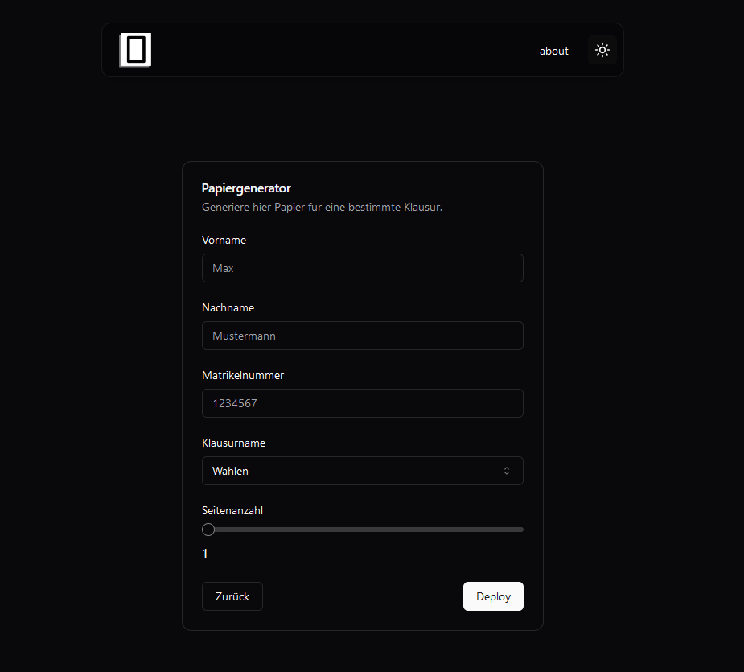
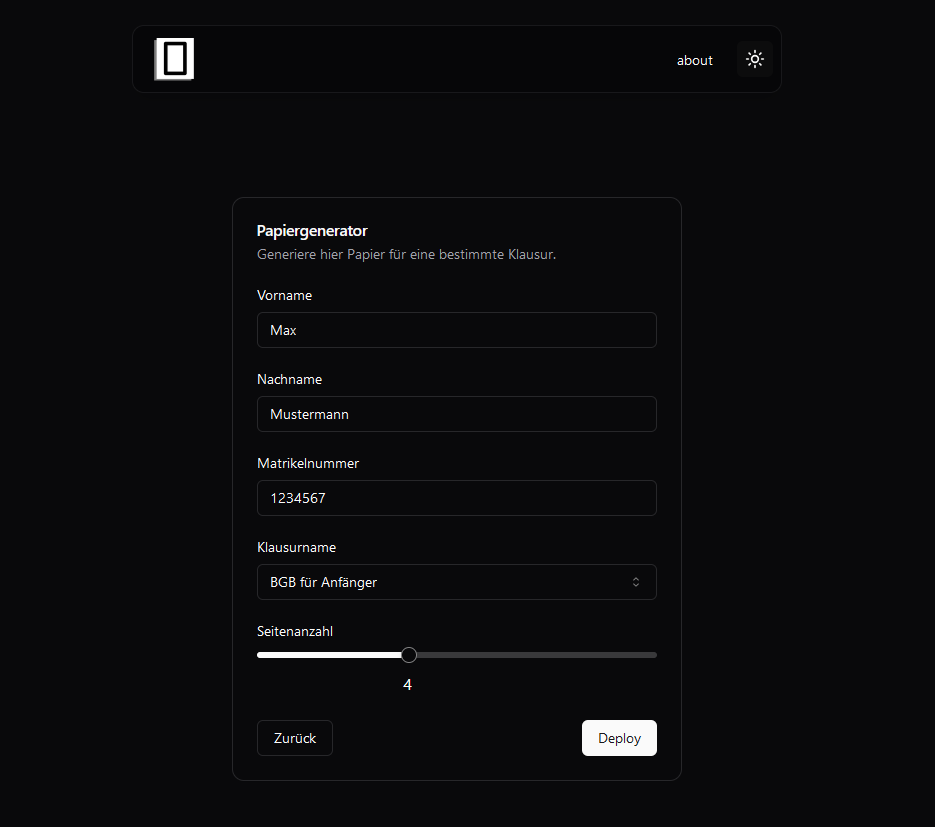

# Klausurpapier Generator

## Projektbeschreibung

Dieses Projekt bietet eine effiziente Lösung zur Erstellung von formatiertem Papier für Klausuren in verschiedenen Rechtsgebieten wie BGB, HGB und mehr. Die Webseite ermöglicht es Studierenden, personalisiertes Papier für ihre Prüfungen zu generieren, ohne dass sie ihre Stammdaten auf jeder einzelnen Seite manuell notieren müssen.

## Funktionen

- **Personalisierte Papiererstellung**: Stammdaten wie Name, Vorname und Matrikelnummer können eingegeben werden, um personalisiertes Papier für die Klausuren zu generieren.
- **Verschiedene Rechtsgebiete**: Für jedes Rechtsmodul, das am ZAR geprüft wird, kann vorformatiertes Papier erstellt werden.
- **Datenschutz**: Die eingegebenen Daten werden nur vorübergehend zur Erstellung des Dokuments verwendet und nicht gespeichert oder für andere Zwecke genutzt.

## Nutzung

1. Die Website [klausurpapier.eu](https://www.klausurpapier.eu) aufrufen.
2. Auf den Menüpunkt „Papier generieren“ klicken, um zur Eingabemaske zu gelangen.
3. Die erforderlichen Felder in der Eingabemaske mit den persönlichen Informationen ausfüllen.
4. Das gewünschte Rechtsgebiet sowie die Seitenzahl auswählen.
5. Das Klausurpapier erstellen lassen und es herunterladen.

## Beispiele

#### Eingabemaske leer

#### Eingabemaske ausgefüllt

#### Formatiertes Klausurpapier

## Datenschutz

Die eingegebenen Informationen wie Name, Vorname und Matrikelnummer werden nur vorübergehend zur Erstellung des Dokuments benötigt. Diese Daten werden nicht gespeichert oder für andere Zwecke verwendet. Nach der Generierung des Papiers sind die Informationen nicht mehr zugänglich.

## Kontakt

Für weitere Fragen oder Anregungen steht jederzeit die Möglichkeit zur Verfügung, Kontakt aufzunehmen. Jede Rückmeldung ist willkommen.

[info@klausurpapier.eu](mailto:info@klausurpapier.eu)
